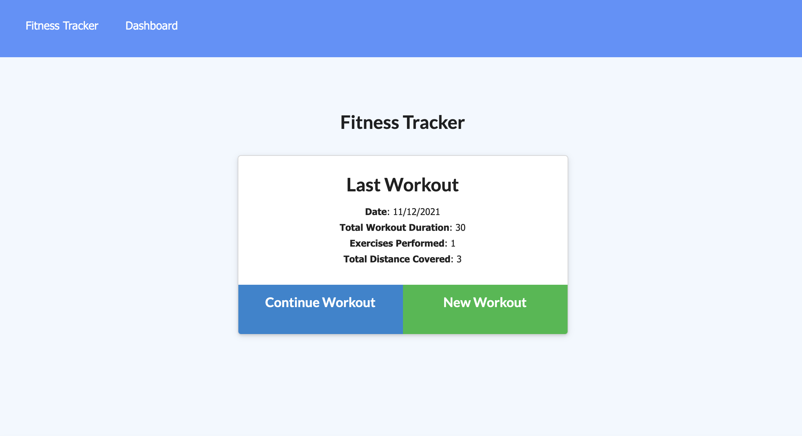

# Fitness Tracker

## Objectives
Build an application that tracks workouts. A user can enter new exercises each day of either resistance or cardio. The app tracks workout duration, weights lifted, distance, etc. A stats page shows data from workouts from the past 7 days.

## Screenshot

## Link to GitHub Repo
[Link to the Github Repo](https://github.com/erikaosterbur/e-commerce-back-end.git)
